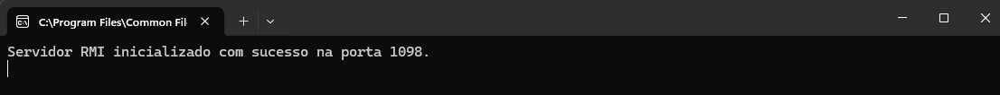
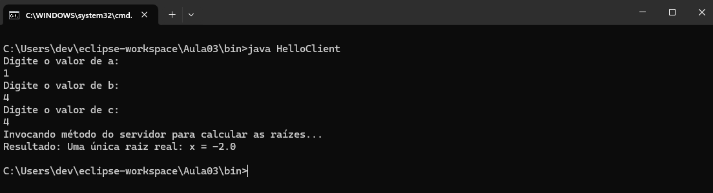
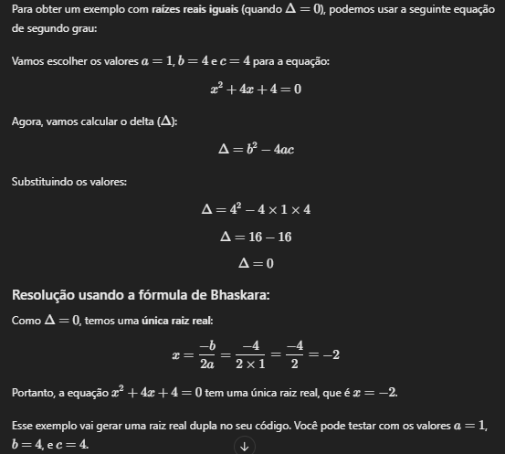
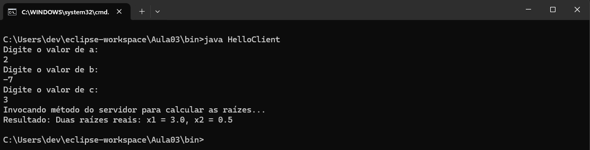
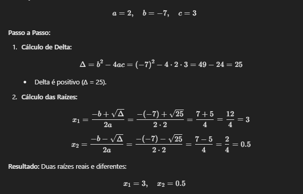
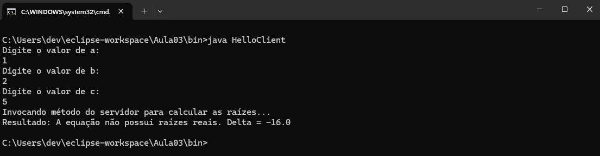
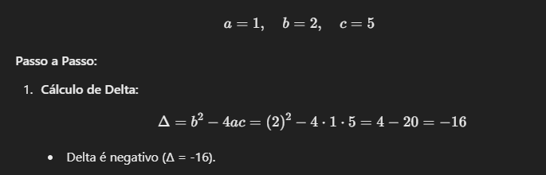

# Chamada Remota RMI

Atividade prática realizada para a disciplina de *Sistemas Distribuídos* sob a orientação do professor [Jefferson Silva Lopes](https://github.com/Jeffersonl22).

O objetivo é realizar chamadas remotas de métodos via RMI (Remote Method Invocation) em Java. Para o desenvolvimento da atividade, foi implementado um mini-projeto em Java que resolve uma **equação de segundo grau** utilizando um servidor e um cliente que se comunicam remotamente.

## Descrição do Projeto

Este projeto utiliza a tecnologia RMI do Java para permitir que um cliente envie os coeficientes de uma equação de segundo grau (`a`, `b`, `c`) ao servidor, o qual realiza o cálculo das raízes e retorna o resultado para o cliente.

## Tecnologias Utilizadas

- **Linguagem**: Java
- **Conceito**: RMI (Remote Method Invocation)
- **Ferramentas**: 
  - Terminal/Console
  - Biblioteca RMI do Java
  - Eclipse IDE
  
## Estrutura do Projeto

1. **Servidor**: 
   - Calcula as raízes da equação de segundo grau com base nos valores recebidos do cliente.
   
2. **Cliente**: 
   - Envia os valores `a`, `b` e `c` ao servidor e exibe o resultado retornado.

## Execução do Projeto

As imagens a seguir mostram o servidor e o cliente em funcionamento:

#### Execução do Servidor

#### Execução do Cliente

### Validação do Resultado

A prova real do cálculo da equação de segundo grau, como mostrado na imagem abaixo, confirma que o cálculo das raízes realizado pelo servidor RMI está correto:

#### Prova Real

---

## Possibilidades de respostas de uma equação de segundo grau.

### Duas Raízes Reais e Distintas (Delta > 0)
- Quando o discriminante (Delta) é maior que zero, a equação possui duas raízes reais e distintas.
#### Sistema

#### Prova Real

### Uma Raiz Real e Única (Delta = 0)
- Quando o discriminante é igual a zero, a equação tem uma única raiz real, também chamada de raiz dupla.
#### Sistema

#### Prova Real

### Sem Raízes Reais (Delta < 0)
- Quando o discriminante é menor que zero, a equação não possui raízes reais, apenas raízes complexas.
#### Sistema

##### Prova Real

---

Este trabalho demonstrou na prática como as chamadas remotas via RMI podem ser utilizadas para distribuir processos entre um servidor e um cliente, resolvendo problemas de maneira eficaz e descentralizada.
